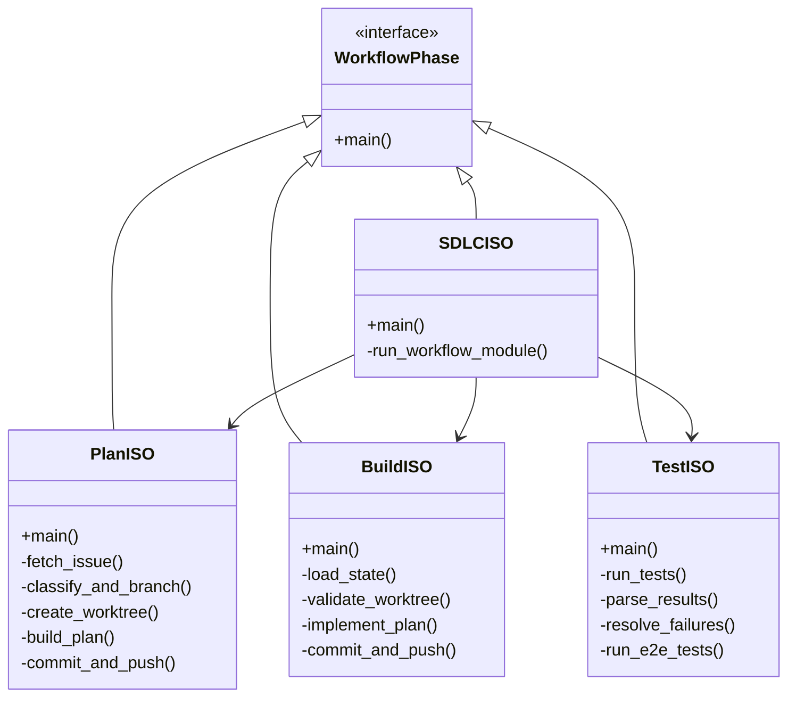

# CxC Framework Design Specification (Claude)

**Version:** 1.0.0
**Date:** 2025-12-30
**Status:** Complete

---

## 1. Executive Summary

This document defines the system architecture and design for the CxC (Cortex Code) Framework. CxC is an orchestration system that automates software development lifecycle using Claude Code agents executing in isolated git worktrees.

---

## 2. Architecture Overview

### 2.1 High-Level System Architecture


### 2.2 Component Diagram


---

## 3. Data Flow Diagrams

### 3.1 SDLC Pipeline Data Flow


### 3.2 Plan Phase Detail Flow


### 3.3 Test Resolution Loop


---

## 4. Component Designs

### 4.1 Core Module Architecture

#### 4.1.1 Configuration System (cxc/core/config.py)


**Design Decisions:**
1. Configuration loaded from `.cxc.yaml` in project root
2. Fallback to framework defaults if not found
3. Immutable after load (dataclass)
4. Paths resolved relative to project root

#### 4.1.2 State Management (cxc/core/state.py)


**State Schema:**
```json
{
    "cxc_id": "abc12345",
    "issue_number": "42",
    "branch_name": "feat-issue-42-cxc-abc12345-add-auth",
    "plan_file": "specs/issue-42-cxc-abc12345-add-auth.md",
    "issue_class": "/feature",
    "worktree_path": "/path/to/trees/abc12345",
    "backend_port": 9100,
    "frontend_port": 9200,
    "model_set": "base",
    "cxc_workflow_history": ["cxc_plan_iso", "cxc_build_iso"]
}
```

**Design Decisions:**
1. JSON file persistence at `artifacts/{project_id}/{cxc_id}/cxc_state.json`
2. Automatic save on update for crash recovery
3. Caller tracking for debugging
4. Optional logger injection

#### 4.1.3 Agent Execution (cxc/core/agent.py)


**Execution Flow:**
1. Load template from `commands/{slash_command}.md`
2. Substitute `$1`, `$2`, `$3` with positional args
3. Build Claude Code CLI command
4. Execute with `--output-format jsonl`
5. Parse JSONL for result extraction
6. Save prompt and output to artifacts

**Model Selection Logic:**
```python
HEAVY_COMMANDS = {"/implement", "/document", "/feature", "/bug", "/chore", "/patch"}
model = "opus" if slash_command in HEAVY_COMMANDS else "sonnet"
```

### 4.2 Integration Layer Architecture

#### 4.2.1 GitHub Integration (cxc/integrations/github.py)


**Design Decisions:**
1. All operations via `gh` CLI (not direct API)
2. Authentication via `GITHUB_PAT` or `gh auth`
3. JSON output parsing via `--json` flag
4. Subprocess execution with safe environment

#### 4.2.2 Git Operations (cxc/integrations/git_ops.py)


**Design Decisions:**
1. All operations support explicit `cwd` for worktree context
2. Return tuple of (success, error_message)
3. Use git CLI commands directly
4. No GitPython for subprocess isolation

#### 4.2.3 Worktree Management (cxc/integrations/worktree_ops.py)


**Port Allocation Algorithm:**
```python
def get_ports_for_cxc(cxc_id: str) -> Tuple[int, int]:
    # Deterministic hash-based allocation
    hash_val = int(hashlib.md5(cxc_id.encode()).hexdigest(), 16)
    offset = hash_val % 15  # 0-14 range
    backend_port = 9100 + offset
    frontend_port = 9200 + offset
    return backend_port, frontend_port
```

**Worktree Directory Structure:**
```
artifacts/{org}/{repo}/
  trees/
    {cxc_id}/
      .git                 # Worktree git directory
      .ports.env           # Port configuration
      specs/               # Plan files
      src/                 # Source code
      ...                  # Full project structure
```

### 4.3 Workflow Engine Architecture

#### 4.3.1 Workflow Phase Interface



**Phase Chaining:**


---

## 5. Data Models

### 5.1 Core Data Types


### 5.2 Type Literals

```python
# Slash Commands
SlashCommand = Literal[
    "/feature", "/bug", "/chore", "/patch",
    "/implement", "/review", "/document",
    "/test", "/test_e2e",
    "/resolve_failed_test", "/resolve_failed_e2e_test",
    "/classify_issue", "/classify_and_branch",
    "/generate_branch_name", "/install_worktree",
    "/commit", "/pull_request", "/cleanup_worktrees",
    "/prime", "/prepare_app", "/start", "/health_check"
]

# Issue Classification
IssueClassSlashCommand = Literal["/feature", "/bug", "/chore", "/patch"]

# Model Selection
ModelSet = Literal["base", "heavy"]

# Issue Severity
IssueSeverity = Literal["skippable", "tech_debt", "blocker"]
```

---

## 6. Command Template System

### 6.1 Template Structure


### 6.2 Template Categories

| Category           | Commands                                                     | Model |
| :----------------- | :----------------------------------------------------------- | :---- |
| Classification     | `/classify_issue`, `/classify_and_branch`                    | haiku |
| Planning           | `/feature`, `/bug`, `/chore`, `/patch`                       | opus  |
| Implementation     | `/implement`                                                 | opus  |
| Testing            | `/test`, `/test_e2e`, `/resolve_failed_test`, `/resolve_failed_e2e_test` | sonnet |
| Review             | `/review`                                                    | sonnet |
| Documentation      | `/document`                                                  | opus  |
| Infrastructure     | `/install_worktree`, `/cleanup_worktrees`, `/commit`, `/pull_request` | sonnet |
| App-specific       | `/prepare_app`, `/start`, `/health_check`, `/prime`          | sonnet |

### 6.3 Template Search Order


---

## 7. Trigger Mechanisms

### 7.1 CLI Router


### 7.2 Webhook Flow


**Magic Keywords:**
```python
CxC_KEYWORDS = {
    "cxc_plan_iso": "plan_iso",
    "cxc_build_iso": "build_iso",
    "cxc_test_iso": "test_iso",
    "cxc_review_iso": "review_iso",
    "cxc_document_iso": "document_iso",
    "cxc_ship_iso": "ship_iso",
    "cxc_sdlc_iso": "sdlc_iso",
    "cxc_sdlc_zte_iso": "sdlc_zte_iso",
}
```

---

## 8. Artifact Organization

### 8.1 Directory Structure

```
project-root/
  .cxc.yaml                     # Project configuration
  .env                          # Environment variables
  specs/
    issue-42-cxc-abc12345-add-auth.md     # Implementation plans
    patch/
      issue-42-review-fix.md              # Patch plans
  app_docs/
    feature-abc12345-auth.md              # Generated docs
    assets/
      01_login_screen.png                 # Review screenshots
  artifacts/
    org/
      repo/
        abc12345/                         # CxC instance
          cxc_state.json                  # Workflow state
          ops/
            prompts/
              2025-12-30_12-00-00.md      # Saved prompts
            execution.log                  # Execution logs
          sdlc_planner/
            raw_output.jsonl              # Agent output
          sdlc_implementor/
            raw_output.jsonl
          test_runner/
            raw_output.jsonl
          reviewer/
            review_img/
              01_critical_feature.png
            raw_output.jsonl
        trees/
          abc12345/                       # Git worktree
            .ports.env                    # Port configuration
            .git/                         # Worktree git
            src/
            specs/
            ...
```

### 8.2 Logging Strategy


---

## 9. Security Considerations

### 9.1 Environment Variable Handling

```python
SAFE_ENV_VARS = {
    # Required
    "ANTHROPIC_API_KEY",
    "CLAUDE_CODE_PATH",

    # Optional secrets
    "GITHUB_PAT",
    "E2B_API_KEY",

    # System essentials
    "HOME", "USER", "PATH", "SHELL", "TERM",
    "PYTHONPATH", "PYTHONUNBUFFERED",
}

def get_safe_subprocess_env() -> dict:
    """Filter env vars for subprocess execution."""
    return {k: os.getenv(k) for k in SAFE_ENV_VARS if os.getenv(k)}
```

### 9.2 Webhook Signature Verification

```python
def verify_github_signature(payload: bytes, signature: str, secret: str) -> bool:
    """Verify GitHub webhook signature."""
    expected = hmac.new(secret.encode(), payload, hashlib.sha256).hexdigest()
    return hmac.compare_digest(f"sha256={expected}", signature)
```

---

## 10. Error Handling Strategy

### 10.1 Phase-Level Error Handling


### 10.2 Test Resolution Strategy

| Attempt | Action                                  | On Failure                    |
| :------ | :-------------------------------------- | :---------------------------- |
| 1       | Run tests                               | Identify failures             |
| 2       | Resolve each failure with agent         | Track resolved vs unresolved  |
| 3       | Re-run tests after resolution           | If resolved > 0, continue     |
| 4       | Final attempt after second resolution   | Accept remaining failures     |
| Max     | Post summary with remaining failures    | Continue to review phase      |

---

## 11. Performance Optimizations

### 11.1 Combined Classification

Instead of two LLM calls:
```
classify_issue() -> /feature
generate_branch_name() -> feat-issue-42-...
```

Single call via `/classify_and_branch`:
```json
{"issue_class": "/feature", "branch_name": "feat-issue-42-cxc-abc123-add-auth"}
```

**Impact:** 50% reduction in classification latency

### 11.2 Deterministic Port Allocation

Instead of scanning for available ports:
```python
for port in range(9100, 9115):
    if is_available(port):
        return port
```

Hash-based allocation:
```python
offset = hash(cxc_id) % 15
return 9100 + offset
```

**Impact:** O(1) vs O(n) port allocation

### 11.3 State Persistence Strategy

- Save state after each update (crash recovery)
- Load state once per phase (not per function)
- JSON format for human readability and debugging

---

## 12. Extensibility Points

### 12.1 Custom Command Templates

```
project/.claude/commands/
  prepare_app.md      # Custom app preparation
  start.md            # Custom app startup
  test_e2e.md         # Custom E2E test execution
  health_check.md     # Custom health checks
  e2e/
    test_login.md     # Feature-specific E2E tests
    test_search.md
```

### 12.2 App-Specific Configuration

```yaml
# .cxc.yaml
app:
  backend_dir: "./app/server"
  frontend_dir: "./app/client"
  test_command: "pytest tests/ -v"
  reset_db_script: "./scripts/reset_db.sh"
  start_script: "./scripts/start.sh"
  typecheck_command: "npm run typecheck"
  build_command: "npm run build"
```

### 12.3 Workflow Customization

- Composite workflows in `workflows/wt/` (e.g., `plan_build_iso.py`)
- Flags for phase skipping (`--skip-e2e`, `--skip-resolution`)
- Model set override via webhook comment (`model_set heavy`)

---

## 13. Dependencies

### 13.1 Python Dependencies

| Package         | Version    | Purpose                        |
| :-------------- | :--------- | :----------------------------- |
| python-dotenv   | >=1.0.0    | Environment variable loading   |
| pydantic        | >=2.0.0    | Data validation and models     |
| pyyaml          | >=6.0.0    | YAML configuration parsing     |
| GitPython       | >=3.0.0    | Git repository operations      |
| schedule        | >=1.2.0    | Cron trigger scheduling        |
| fastapi         | >=0.100.0  | Webhook server                 |
| uvicorn         | >=0.23.0   | ASGI server for webhooks       |
| aiosqlite       | >=0.19.0   | Async SQLite for state         |
| boto3           | >=1.26.0   | R2/S3 artifact uploads         |
| rich            | >=13.0.0   | Terminal output formatting     |

### 13.2 External Dependencies

| Tool         | Purpose                       |
| :----------- | :---------------------------- |
| `claude`     | Claude Code CLI               |
| `gh`         | GitHub CLI                    |
| `git`        | Version control               |
| `uv`         | Python package manager        |

---

*End of Design Specification*
