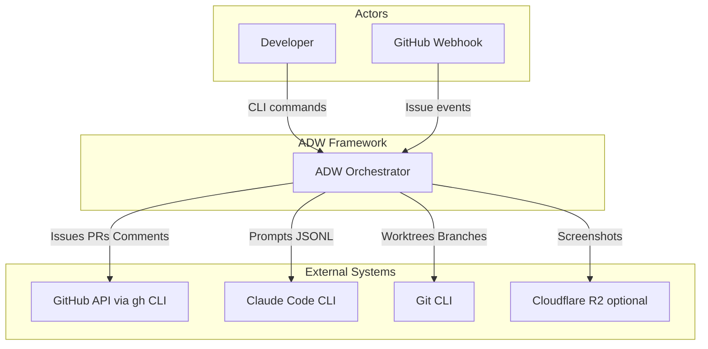
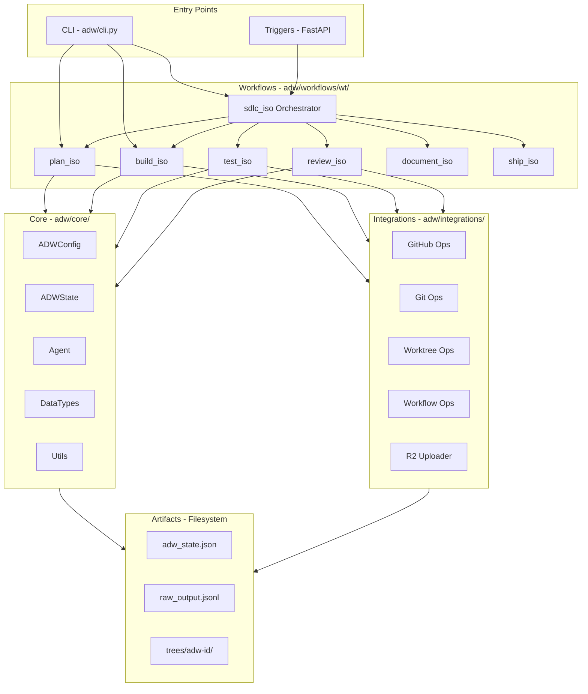
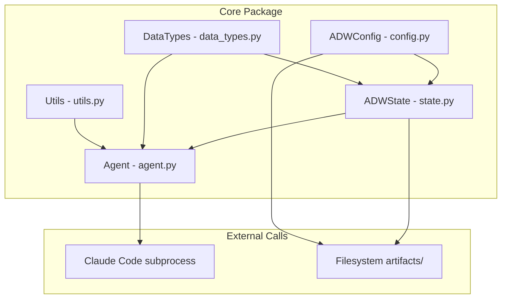
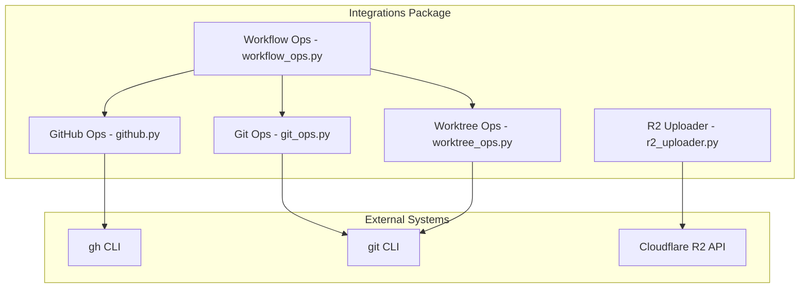
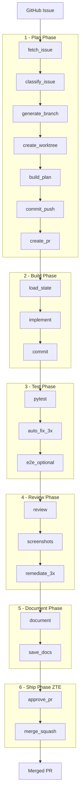

# ADW Framework - C4 Architecture Diagrams (Claude)

> **For**: New developers onboarding to the ADW Framework
> **C4 Model**: Context, Container, Component diagrams + Data Flow

---

## Quick Navigation

| Diagram                                                | What It Shows          | Best For                              |
| ------------------------------------------------------ | ---------------------- | ------------------------------------- |
| [Level 1: Context](#level-1-system-context)            | ADW + external systems | Understanding the ecosystem           |
| [Level 2: Container](#level-2-containers)              | Internal packages      | Finding where code lives              |
| [Level 3: Core](#level-3-core-components)              | Core module internals  | Understanding state/config/agent      |
| [Level 3: Integrations](#level-3-integrations-components) | Integration internals  | Understanding GitHub/Git/Worktree ops |
| [Data Flow](#data-flow-sdlc-execution-path)            | SDLC execution path    | Following a workflow end-to-end       |

---

## What is C4?

C4 is a lightweight architecture documentation approach with 4 levels of abstraction:

1. **Context** - How the system fits in the world (users, external systems)
2. **Container** - High-level technical building blocks (packages, databases, services)
3. **Component** - Internal components within each container
4. **Code** - Class/function level (not included here - too detailed)

Read diagrams **top-down**: start with Context, zoom into Containers, then Components.

---

## Level 1: System Context

*Shows ADW and everything it interacts with*



**ASCII version:**

```
     +-------------+       +------------------+
     |  Developer  |       | GitHub Webhook   |
     +------+------+       +--------+---------+
            |                       |
            | CLI commands          | Issue events
            v                       v
    +-------+-----------------------+---------+
    |                                         |
    |           ADW Orchestrator              |
    |                                         |
    +--+----------+----------+----------+-----+
       |          |          |          |
       v          v          v          v
  +--------+ +--------+ +--------+ +----------+
  | GitHub | | Claude | |  Git   | |    R2    |
  |  API   | |  Code  | |  CLI   | | optional |
  +--------+ +--------+ +--------+ +----------+
```

### Key Takeaways

| Actor/System       | Interaction                                           |
| ------------------ | ----------------------------------------------------- |
| **Developer**      | Runs `uv run adw sdlc 42` to process GitHub issues    |
| **GitHub Webhook** | Triggers workflows when issues are created/commented  |
| **GitHub API**     | Read issues, post comments, create PRs (via `gh` CLI) |
| **Claude Code**    | Execute AI prompts, receive JSONL streaming output    |
| **Git**            | Create worktrees, branches, commits, push changes     |
| **Cloudflare R2**  | Optional - store screenshots for review phase         |

---

## Level 2: Containers

*Shows the major packages inside ADW*



**ASCII version:**

```
+-------------------ENTRY POINTS--------------------+
|   +------------+            +----------------+    |
|   | CLI        |            | Triggers       |    |
|   | adw/cli.py |            | FastAPI/Cron   |    |
|   +-----+------+            +-------+--------+    |
+---------|-----------------------|------------------+
          |                       |
          v                       v
+-------------------WORKFLOWS-----------------------+
|  +--------+ +--------+ +--------+ +--------+      |
|  |plan_iso| |build_  | |test_   | |review_ |      |
|  +--------+ |iso     | |iso     | |iso     |      |
|             +--------+ +--------+ +--------+      |
|  +----------+ +--------+                          |
|  |document_ | |ship_iso|   +------------------+   |
|  |iso       | +--------+   | sdlc_iso         |   |
|  +----------+              | (orchestrator)   |   |
|                            +------------------+   |
+--------+------------------------------+-----------+
         |                              |
         v                              v
+--------+--------+          +----------+---------+
| CORE            |          | INTEGRATIONS       |
| adw/core/       |          | adw/integrations/  |
|-----------------|          |--------------------|
| ADWConfig       |          | GitHub Ops         |
| ADWState        |          | Git Ops            |
| Agent           |          | Worktree Ops       |
| DataTypes       |          | Workflow Ops       |
| Utils           |          | R2 Uploader        |
+--------+--------+          +----------+---------+
         |                              |
         v                              v
+-------------------STORAGE---------------------+
|  adw_state.json   raw_output.jsonl   trees/  |
+-----------------------------------------------+
```

### Container Summary

| Container        | Path                | Purpose                                    |
| ---------------- | ------------------- | ------------------------------------------ |
| **CLI**          | `adw/cli.py`        | Entry point, routes commands to workflows  |
| **Triggers**     | `adw/triggers/`     | Webhook server (FastAPI), cron monitor     |
| **Workflows**    | `adw/workflows/wt/` | SDLC phases - isolated worktree workflows  |
| **Core**         | `adw/core/`         | Config, state, agent execution, data types |
| **Integrations** | `adw/integrations/` | GitHub, Git, worktree, R2 operations       |
| **Storage**      | `artifacts/`        | State JSON, agent logs, git worktrees      |

---

## Level 3: Core Components

*Zooms into the `adw/core/` package*



**ASCII version:**

```
+---------------------CORE PACKAGE-----------------------+
|                                                        |
|  +---------------+                                     |
|  | ADWConfig     |------------------+                  |
|  | config.py     |                  |                  |
|  +-------+-------+                  |                  |
|          |                          v                  |
|          |               +------------------+          |
|          +-------------->| ADWState         |          |
|                          | state.py         |          |
|                          +--------+---------+          |
|                                   |                    |
|  +---------------+                v                    |
|  | DataTypes     |       +--------+---------+          |
|  | data_types.py |------>| Agent            |          |
|  +---------------+       | agent.py         |          |
|                          +--------+---------+          |
|  +---------------+                ^                    |
|  | Utils         |----------------+                    |
|  | utils.py      |                                     |
|  +---------------+                                     |
|                                                        |
+-------------------+------------------+-----------------+
                    |                  |
                    v                  v
          +------------------+  +------------------+
          | Claude Code CLI  |  | Filesystem       |
          | subprocess.Popen |  | artifacts/       |
          +------------------+  +------------------+
```

### Core Component Details

| Component     | File            | Key Functions                                               |
| ------------- | --------------- | ----------------------------------------------------------- |
| **ADWConfig** | `config.py`     | `load()`, `get_agents_dir()`, `get_trees_dir()`             |
| **ADWState**  | `state.py`      | `save()`, `load()`, `update()`, `get_working_directory()`   |
| **Agent**     | `agent.py`      | `execute_template()`, `prompt_claude_code()`, `parse_jsonl` |
| **DataTypes** | `data_types.py` | `ADWStateData`, `AgentPromptRequest`, `RetryCode`           |
| **Utils**     | `utils.py`      | `setup_logger()`, `check_env_vars()`, `get_safe_env()`      |

---

## Level 3: Integrations Components

*Zooms into the `adw/integrations/` package*



**ASCII version:**

```
+------------------INTEGRATIONS PACKAGE------------------+
|                                                        |
|                +--------------------+                  |
|                | Workflow Ops       |                  |
|                | workflow_ops.py    |                  |
|                +---------+----------+                  |
|                          |                             |
|          +---------------+---------------+             |
|          |               |               |             |
|          v               v               v             |
|   +------------+  +------------+  +--------------+     |
|   | GitHub Ops |  | Git Ops    |  | Worktree Ops |     |
|   | github.py  |  | git_ops.py |  | worktree_ops |     |
|   +-----+------+  +-----+------+  +-------+------+     |
|         |               |                 |            |
|         |               |                 |            |
|         |         +-----+-----+           |            |
|         |         |           |           |            |
+---------|---------|-----------|-----------|------------+
          |         |           |           |
          v         v           v           v
     +--------+ +--------+ +--------+ +-----------+
     | gh CLI | |git CLI | |git CLI | | R2 API    |
     +--------+ +--------+ +--------+ +-----------+
                                      (R2 Uploader)
```

### Integrations Component Details

| Component        | File              | Key Functions                                           |
| ---------------- | ----------------- | ------------------------------------------------------- |
| **GitHub Ops**   | `github.py`       | `fetch_issue()`, `make_issue_comment()`, `get_repo_url` |
| **Git Ops**      | `git_ops.py`      | `commit_changes()`, `finalize_git_operations()`         |
| **Worktree Ops** | `worktree_ops.py` | `create_worktree()`, `validate_worktree()`, `get_ports` |
| **Workflow Ops** | `workflow_ops.py` | `ensure_adw_id()`, `classify_issue()`, `build_plan()`   |
| **R2 Uploader**  | `r2_uploader.py`  | `upload_screenshot()`, `get_public_url()`               |

---

## Data Flow: SDLC Execution Path

*Shows how data flows through a complete `adw sdlc 42` run*



**ASCII version:**

```
                      +----------------+
                      | GitHub Issue   |
                      +-------+--------+
                              |
                              v
+======================1. PLAN PHASE=======================+
|                                                          |
|  fetch_issue -> classify_issue -> generate_branch        |
|                                         |                |
|                                         v                |
|  create_pr <- commit_push <- build_plan <- create_wt     |
|                                                          |
+=============================+============================+
                              |
                              v
+======================2. BUILD PHASE======================+
|                                                          |
|  load_state ---------> implement ---------> commit       |
|                                                          |
+=============================+============================+
                              |
                              v
+======================3. TEST PHASE=======================+
|                                                          |
|  pytest ---------> auto_fix (x3) ---------> e2e (opt)    |
|                                                          |
+=============================+============================+
                              |
                              v
+======================4. REVIEW PHASE=====================+
|                                                          |
|  review ---------> screenshots ---------> remediate (x3) |
|                                                          |
+=============================+============================+
                              |
                              v
+======================5. DOCUMENT PHASE===================+
|                                                          |
|  document ---------> save_docs                           |
|                                                          |
+=============================+============================+
                              |
                              v
+======================6. SHIP PHASE (ZTE)=================+
|                                                          |
|  approve_pr ---------> merge_squash                      |
|                                                          |
+=============================+============================+
                              |
                              v
                      +----------------+
                      |   Merged PR    |
                      +----------------+
```

### Phase-by-Phase Breakdown

| Phase        | Key Operations                                   | State Changes                                         |
| ------------ | ------------------------------------------------ | ----------------------------------------------------- |
| **Plan**     | Fetch issue, classify, create worktree, gen plan | `issue_class`, `branch_name`, `worktree_path`, `plan` |
| **Build**    | Load plan file, execute `/implement`             | Code changes committed                                |
| **Test**     | Run pytest, auto-fix up to 3x                    | Tests passing                                         |
| **Review**   | Validate against spec, screenshots               | Review artifacts                                      |
| **Document** | Generate feature docs                            | `app_docs/` updated                                   |
| **Ship**     | Approve PR, squash merge                         | PR merged to main                                     |

---

## Key Concepts Reference

| Concept               | Description                                                                     |
| --------------------- | ------------------------------------------------------------------------------- |
| **ADW ID**            | 8-character unique identifier per workflow instance (e.g., `abc12345`)          |
| **Isolated Worktree** | Each workflow runs in `artifacts/{project_id}/trees/{adw-id}/`                  |
| **Port Allocation**   | Deterministic: backend 9100-9114, frontend 9200-9214                            |
| **Model Selection**   | `base` uses Sonnet, `heavy` uses Opus (configured per command)                  |
| **State Persistence** | `adw_state.json` tracks: adw_id, issue_number, branch_name, plan_file, worktree |

---

## File Structure After ADW Run

```
artifacts/{org}/{repo}/
    {adw-id}/
        adw_state.json           # Workflow state
        sdlc_planner/
            raw_output.jsonl     # Claude Code output
            prompts/
                feature.txt      # Saved prompt
        sdlc_implementor/
        tester/
        reviewer/
            review_img/          # Screenshots
        documenter/
    trees/
        {adw-id}/                # Git worktree (full repo clone)
            .ports.env           # Backend/frontend ports
            specs/
                issue-42-adw-abc12345-add-auth.md
```

---

## See Also

- [ORCHESTRATOR_GUIDE.md](./ORCHESTRATOR_GUIDE.md) - Detailed workflow documentation
- [README.md](../README.md) - Setup and configuration
- [commands/](../commands/) - Slash command templates
